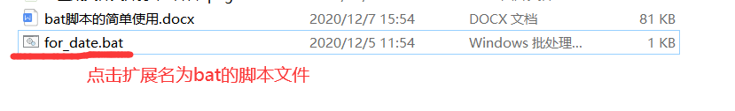
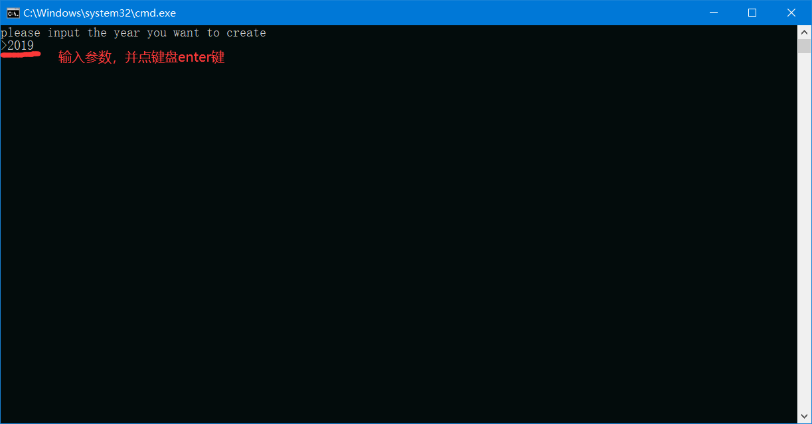
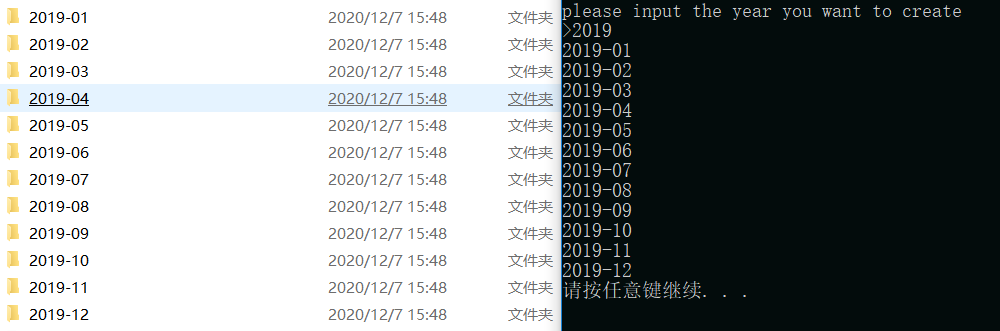

## bat脚本的简单使用（一）

前言：刚上大一的时候，听别人说，却不知道到底怎么写、怎么用；我现在的理解是，脚本是用来减少工作量的工具（但有学习成本）比如：

[TOC]

### 1、创建某年开头名称的文件夹

点击脚本文件后 → 输入年份等参数（或无参数） → 即完成，如创建某年开头名称的文件夹

#### （1）点击扩展名为bat的脚本文件

 


#### （2）输入参数，回车

 

#### （3）完成，执行结果

 

点击链接下载尝试一下吧, http://pkcile.cn/job/gis/bat/for_date_year.bat


### 2.解释脚本内容


```
@echo off
SETLOCAL ENABLEDELAYEDEXPANSION
color a
echo please input the year you want to create
set /a month_nth=1
set /p "year_nth=>"
for /l %%i in (1,1,12) do (
    if !month_nth! LSS 10 (
        @REM echo yes
        echo !year_nth!-0!month_nth!
        md !year_nth!-0!month_nth!
    ) else (
        echo !year_nth!-!month_nth!
        md !year_nth!-!month_nth!
    )   
    set /a month_nth+=1
)
pause
```


#### （1）如果想输入一个参数：

如***\*2019\****，即可创建从***\*2019-01\****到***\*2019-12\****的文件夹

所以文件夹的命名格式为，年-月：2019-01

如何实现呢，我们思路是：

第一步：设置变量，将输入的年份的值存入一个变量中；再设置一个变量存月份，给月份一个初始值为1

第二步：字符拼接，年份和月份可拼接在一起，中间加一个符号即可；

第三步：创建文件夹，windows中创建文件命令为md；如要创建2019-01文件夹，即md 2019-01

第四部：利用循环，循环12次，每次执行创建文件夹命令，并将月份的变量加1

完毕！！


#### （2）遇到的问题

遇到的最大的问题就是语法问题，微软的批处理语言语法和平常的编程语言比起来有点复杂

***\*批处理语言中变量如何存取呢？\****

如果是存一个固定变量，可使用：set /a month_nth=1

如果是存一个输入变量，可使用：set /p "year_nth=>"

如果要在在循环中使用变量，需要加一个声明：SETLOCAL ENABLEDELAYEDEXPANSION


***\*批处理语言中变量如何进行字符串拼接呢？\****

在平常拼接变量，2020-01，使用%%来表示变量，即%year_nth%-%month_nth%

在循环拼接变量，2020-01，使用!!来表示变量，即!year_nth!-!month_nth!

 

***\*批处理语言中\*******\*创建文件夹命令是什么？\****

如：md 2020-01

 

***\*批处理语言中如何使用循环？\****

如果想要执行指定次数，如有（初始值、每次执行后加一、有最大执行条件）,则使用下面的for循环类别(/l)：

for /l %%i in (1,1,12) do(

​	备注：要执行的命令

)

 

***\*批处理语言中其他要注意的地方？\****

if循环，判断两值大小关系的条件，如果想判断1是否小于2，则使用：

if 1 less 2 (

​	备注：要执行的命令

) else (

​	备注：要执行的命令

)

 

注释：批处理语言注释使用@rem或::来注释如：

::这是一个注释

@rem这是一个注释

 

echo用来打印字符在黑色命令框中

如： echo hello world

但，一般开头第一句加，echo @off，用来关闭废话的

 

***\*好了差不多了\****


