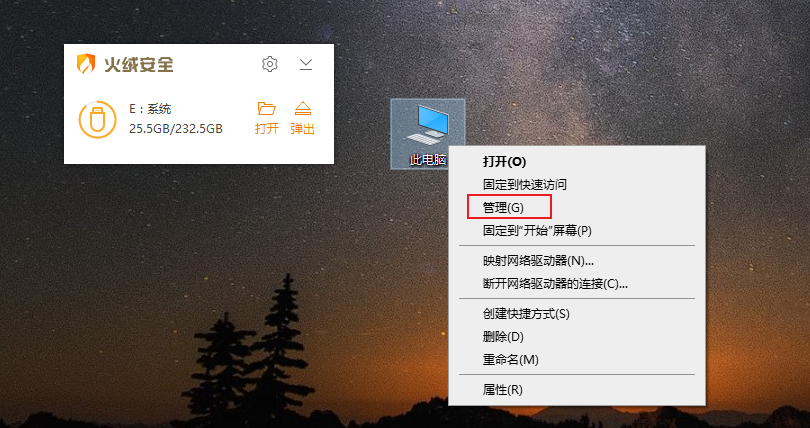
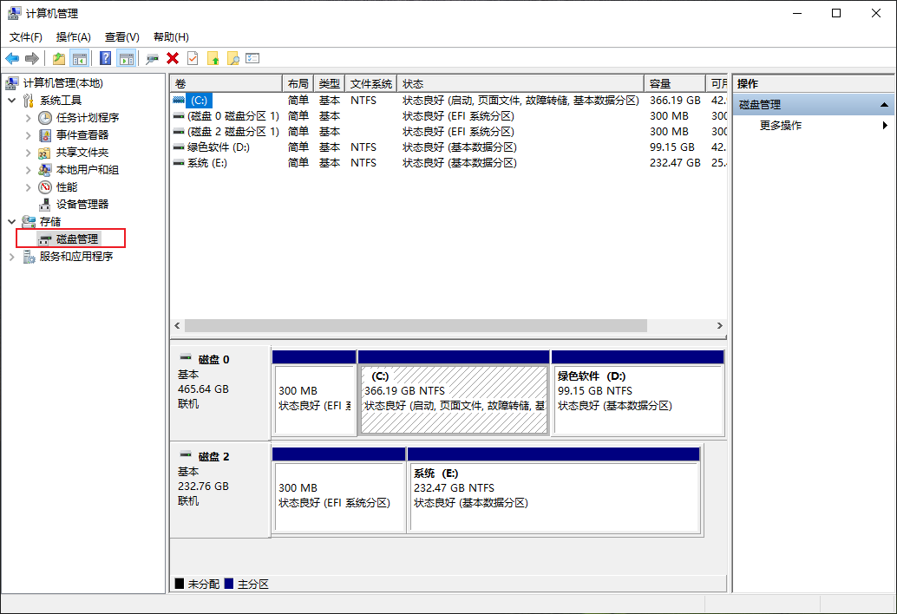
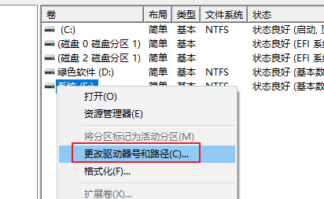
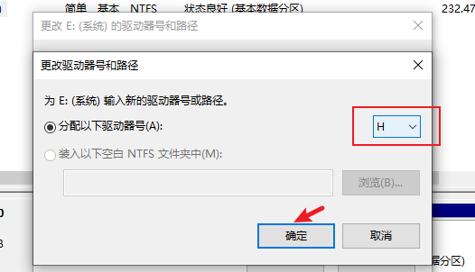
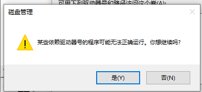

## windows10电脑修改插入的U盘号由E盘改为H盘

windows10 插入U盘后，显示E盘号，想修改为H盘

[TOC]

### 1、在桌面鼠标右键"此电脑"图标后，点击"管理(G)"菜单项

### 2、弹出"计算机管理"页面后，点击存储下的"磁盘管理"项，可以看到C盘到E盘

### 3、右键要更改的系统（E:）盘，点击"更改驱动号和路径(C)..."

### 4、首先右键E:，进入弹出更改驱动账号或路径页面，选择"H"后，点击确认，

### 5、再次确认带点击"是(Y)"完成修改

### 6、完成
