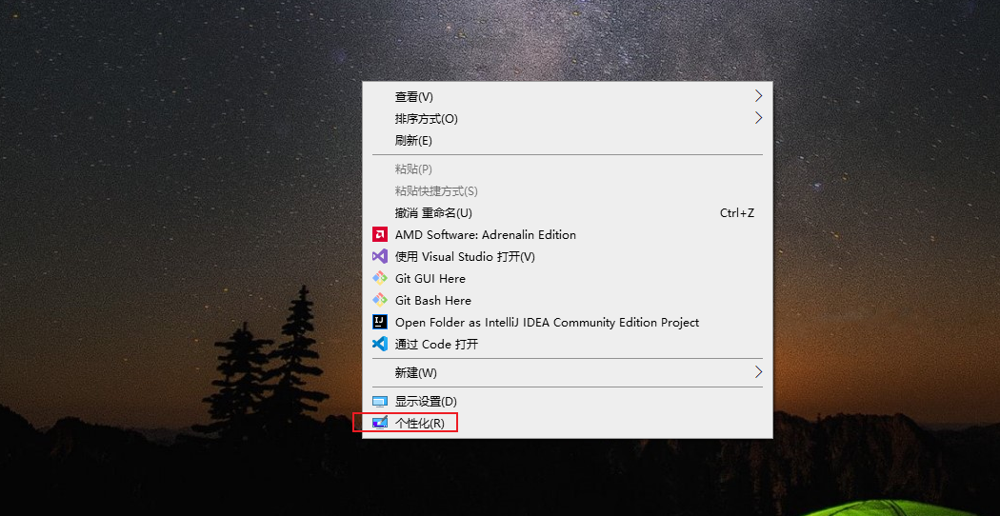
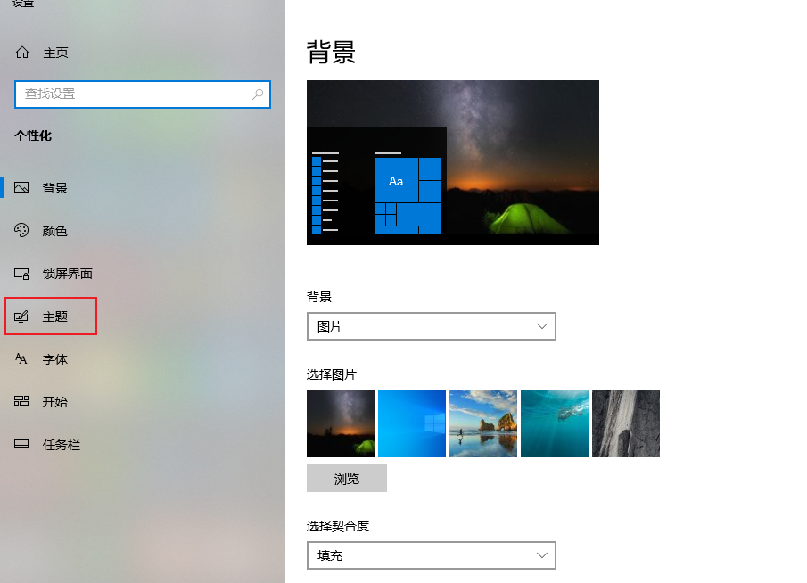
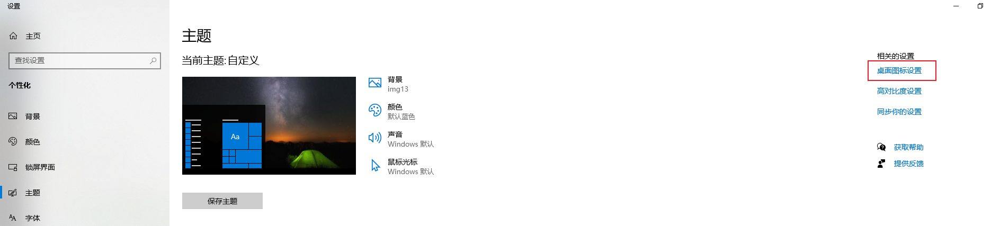
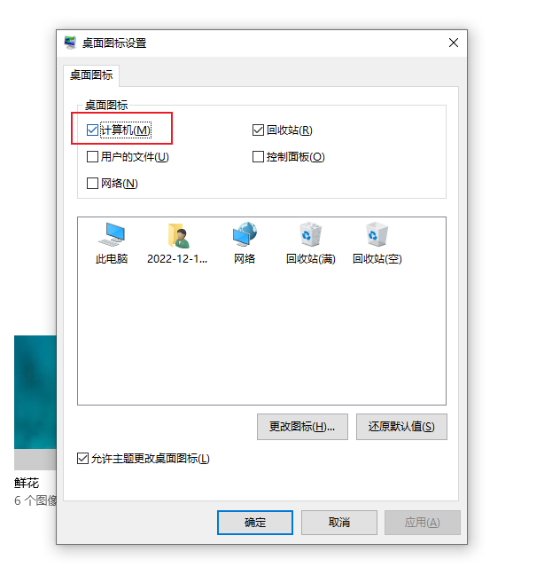
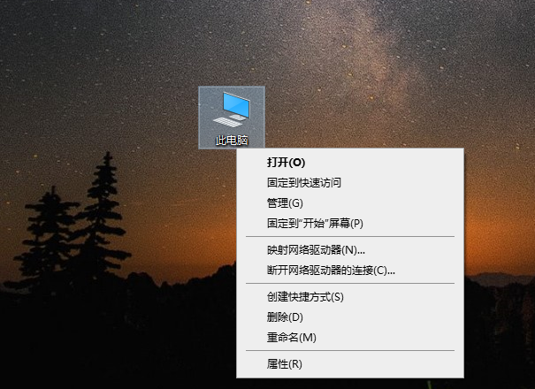

## windows10电脑显示"此电脑"桌面图标

windows10 使用小技巧

[TOC]

### 1、在桌面鼠标右键后，点击"个性化(R)"

### 2、进入设置-主页页面后，点击"主题"

### 3、点击"桌面图标设置"

### 4、弹出"桌面图标设置"页面，勾选桌面图标下的"计算机(M)"选项，最后点击确认

### 5、回到桌面，即可显示"此电脑"图标，右键可以看到可以点击"属性"、"管理(G)"、"映射网络驱动器(N)..."等常用菜单项
