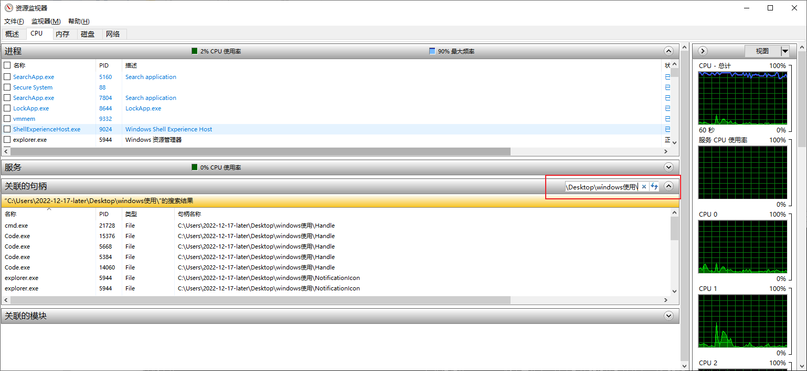
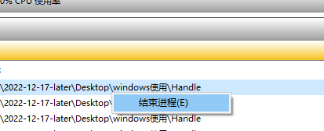
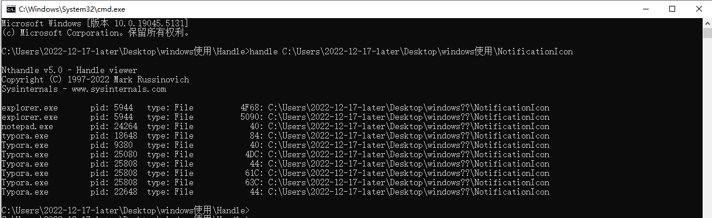
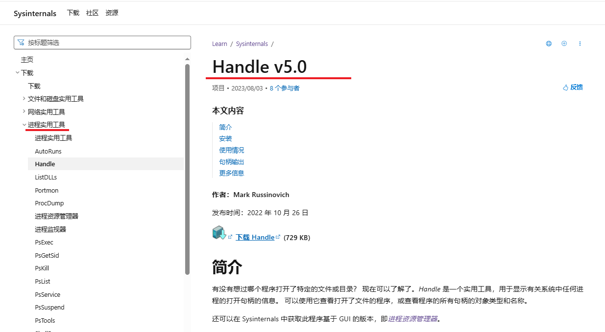
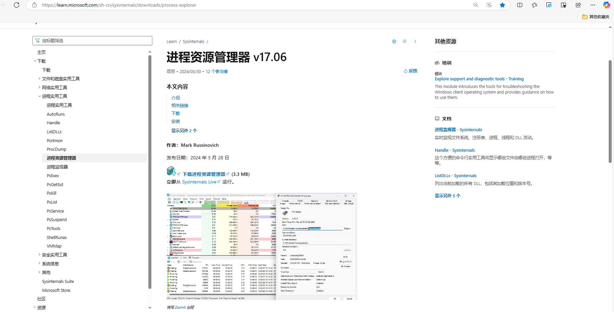

---

title: windows10电脑查看目录或文件占用

date: 2024-11-17 19:16:19

tags: 

- windows10

toc: true

description: 

categories: 

- windows10使用小技巧 

---

文件被占用不能删除，首先需要我们谁在占用，然后再解除对应的占用

[TOC]

## 已知windows10电脑查看文件占用和解决的两种方式

两种方式等的时间都相对比较长，用系统界面方式比用handle快

#### 1.界面方式，打开资源监视器，点击cpu选项，搜索句柄

##### 1.1 鼠标右键"结束进程(E)"来解除占用



#### 2.第三方handle程序，cmd输入目录查询，返回对应的占用程序和占用文件位置
```
handle C:\Users\2022-12-17-later\Desktop\windows使用\NotificationIcon
```


##### 2.1 解除占用
注意：一定不要解除，explorer.exe名称占用；他们对文件占用不能删除没影响

通过杀掉对应的应用对应的pid来解除占用
taskkill /pid 24264 /f

##### 2.2 提升搜索速度
```
handle -p notepad.exe C:\Users\2022-12-17-later\Desktop\windows使用\NotificationIcon
handle -p typora.exe  C:\Users\2022-12-17-later\Desktop\windows使用\NotificationIcon
```

##### 2.3 扩展，进程管理器
Handle v5.0
https://learn.microsoft.com/zh-cn/sysinternals/downloads/handle


进程资源管理器 v17.06
https://learn.microsoft.com/zh-cn/sysinternals/downloads/process-explorer



#### 3.gitee示例地址
https://gitee.com/pkcile/handle.git


