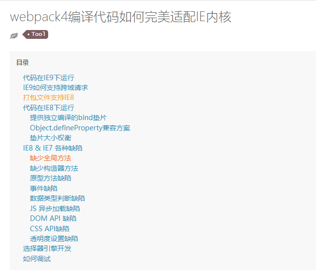

[](https://github.com/pkcile/blog-2020/actions/workflows/tencent-cos.yml)
### 本地开发环境说明
#### 1.环境说明
开发工具依赖在精简中
开发环境：node 16.20.2
电脑配置：
- CPU i7-4710HQ 2.5GHZ
- 内存 ddr3 8G、
- 存储Samsung SSD 870 EVO 250GB


#### 2.安装的开发工具依赖说明
全局安装rimraf，目的删除node_modules
- 1.开发环境依赖占用147MB空间，包含11,803个文件
- 2.移除babel postcss less，54.1 MB空间，包含8,994个文件
- 3.降低css-loader（3.6.0）、css-minimizer-webpack-plugin（2.0.0）版本，临时屏蔽require('node:crypto')使用，可运行在node12环境
- 4.引入preact及相关开发依赖，开发环境下的依赖74.3 MB 11150个文件 ，打包时间延长至8秒
- 5.依赖更新添加less-loader，开发环境下的依赖78.6 MB 11653个文件
- 6.将后端添加到一个项目中方便开发，开发环境下的依赖146MB 16,371个文件(暂缓)
#### 3.命令速记

```
rimraf .\node_modules\
git tag -d v0.1.0
git tag -a "v0.0.7" -m "使用preact改造该项目"
git push origin v0.0.7
git push origin tag -d v0.0.7
```

#### 版本兼容性问题
目前主页的兼容性：>=IE9，chorme >=30，火狐（未测试），x5（未测试）
ie 10、11 promise未识别
```
<!-- “Promise”未定义 -->
import Promise from 'babel-polyfill';
// 解决promise 在ie中未定义的问题
function Promise(executor) {
	this.state = 'pending';
	this.value = undefined;
	this.reason = undefined;
	this.onFulfilledCallbacks = [];
	this.onRejectedCallbacks = [];
	const resolve = (value) => {
	  if (this.state === 'pending') {
		this.state = 'resolved';
		this.value = value;
		this.onFulfilledCallbacks.forEach((callback) => callback(value));
	  }
	};
  
	const reject = (reason) => {
	  if (this.state === 'pending') {
		this.state = 'rejected';
		this.reason = reason;
		this.onRejectedCallbacks.forEach((callback) => callback(reason));
	  }
	};
  
	try {
	  executor(resolve, reject);
	} catch (error) {
	  reject(error);
	}
}
if (!window.Promise) {
	window.Promise = Promise;
}
```
使用AsyncRoute后兼容性降低，最乐观，最好能兼容ie 10+(难，上限)

开发环境下ie 10以上文字（更难)
生产环境缺陷 ie9（工具 SCRIPT1010: 缺少标识符ie8）
路由/#/now/location IE11及以下都不支持
##### 1.webpack兼容性支持

https://longhonour.github.io/2019/09/25/webpack-ie/

##### 2.vue兼容性支持
Vue 不支持 IE8 及以下版本，因为 Vue 使用了 IE8 无法模拟的 ECMAScript 5 特性。但它支持所有兼容 ECMAScript 5 的浏览器。所以IE 7 和 8 咱们就没办法兼容了，但是咱们可以判断浏览器版本后给用户一个友善的升级提醒啊

##### md折叠用法
<details>
<summary>点击展开</summary>

这是隐藏的内容。
- 项目1
- 项目2
</details>