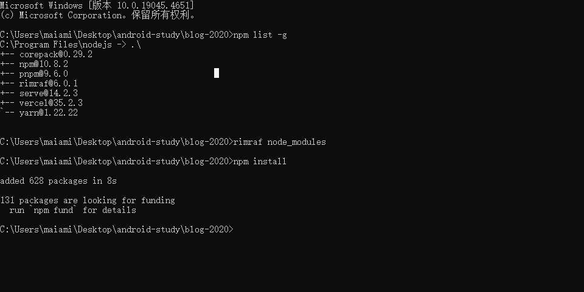

### 本地开发环境说明
#### 说明
开发工具依赖在精简中

#### 安装的开发工具依赖说明
全局安装rimraf，目的删除node_modules

- 1.开发环境依赖占用147MB空间，包含11,803个文件
<!--  -->
- 2.移除babel postcss less，54.1 MB空间，包含8,994个文件
- 3.降低css-loader（3.6.0）、css-minimizer-webpack-plugin（2.0.0）版本，临时屏蔽require('node:crypto')使用，可运行在node12环境
- 4.引入preact及相关开发依赖，开发环境下的依赖74.3 MB 11150个文件 ，打包时间延长至8秒

